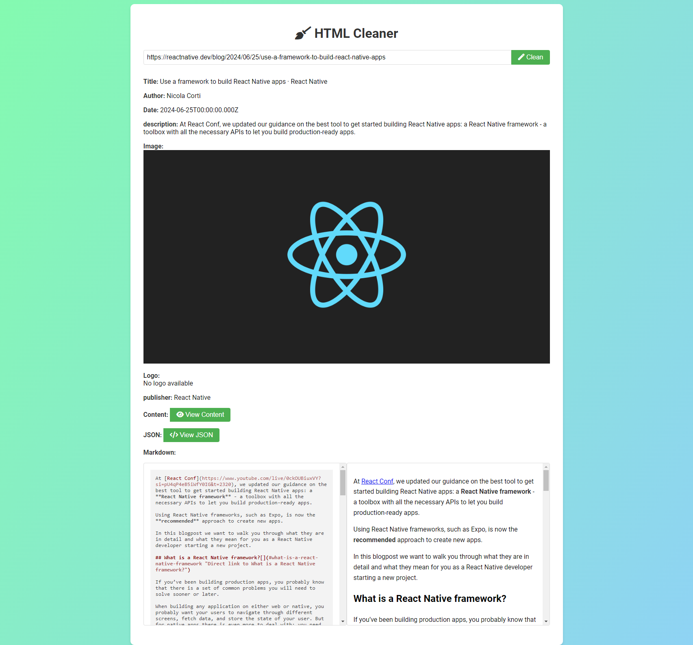

# HTML Cleaner

HTML Cleaner is a service that converts HTML content into readable HTML and Markdown format. It extracts key metadata from web pages and provides a clean, simplified version of the content.



## Features

- Converts HTML to readable format
- Extracts metadata (title, author, description, date, etc.)
- Generates Markdown from cleaned HTML
- Handles tables and preserves important HTML elements
- Pre-processes DOM to remove unnecessary elements

## Installation

### Option 1: Local Installation

1. Clone the repository:
   ```
   git clone https://github.com/fairjm/html-cleaner.git
   cd html-cleaner
   ```

2. Install dependencies:
   ```
   npm install
   ```

3. Start the server:
   ```
   npm start
   ```

   The server will start running on `http://localhost:3000` (or the port specified in your environment variables).

### Option 2: Docker Installation

1. Clone the repository:
   ```
   git clone https://github.com/fairjm/html-cleaner.git
   cd html-cleaner
   ```

2. Build the Docker image:
   ```
   docker build -t html-cleaner:latest .
   ```

3. Run the Docker container:
   ```
   docker run -it -p 3000:3000 html-cleaner
   ```

This will start the server and make it accessible at `http://localhost:3000`.

### Note

Make sure you have [Git](https://git-scm.com/), [Node.js](https://nodejs.org/) (for local installation), or [Docker](https://www.docker.com/) (for Docker installation) installed on your system before proceeding with the respective installation method.

## API

The main endpoint for cleaning HTML is:

```
POST /api/clean
```

Request body:
```json
{
  "url": "https://example.com/article",
  "html": "<html>...</html>"  // Optional, if not provided, the service will fetch the HTML from the URL
}
```

Response:
```json
{
  "title": "Article Title",
  "author": "Author Name",
  "description": "Article description",
  "date": "2023-04-20",
  "logo": "https://example.com/logo.png",
  "image": "https://example.com/featured-image.jpg",
  "publisher": "Publisher Name",
  "content": "<div>Cleaned HTML content...</div>",
  "markdown": "# Article Title\n\nCleaned content in Markdown format..."
}
```

## Main Components

- [Express](https://expressjs.com/): Web application framework
- [JSDOM](https://github.com/jsdom/jsdom): JavaScript implementation of the DOM
- [@mozilla/readability](https://github.com/mozilla/readability): Extracts & simplifies article content
- [Turndown](https://github.com/mixmark-io/turndown): Converts HTML to Markdown
- [Metascraper](https://metascraper.js.org/): Extracts metadata from web pages
- [Puppeteer](https://pptr.dev/): Headless browser for rendering JavaScript-heavy pages
- [Winston](https://github.com/winstonjs/winston): Logging library

## Notes

1. HTML fetching is performed using Puppeteer, which may result in slower processing times, especially for JavaScript-heavy pages.

2. The main codebase was primarily generated by Claude (Sonnet 3.5). The implementation approach was the result of multiple rounds of discussion with the AI. The author's role involved making adjustments and refinements to the AI-generated code.

3. This README was also authored by Claude, with the author providing guidance and specific requirements.

## Limitations and Considerations

- Due to the use of Puppeteer for HTML fetching, the service may have higher resource requirements and slower response times compared to simple HTTP requests.
- The quality of the cleaned HTML and extracted metadata may vary depending on the structure and complexity of the original web page.
- While efforts have been made to handle various HTML structures, some complex or non-standard layouts may not be processed optimally.
- The service is primarily designed for article-style content and may not perform as well on other types of web pages.

## Acknowledgements

Special thanks to the **OpenAI team for developing Claude**(this is what claude tells me....What's wrong with you? Claude, are you serious?), which played a crucial role in the creation of this project. The author acknowledges that the majority of the implementation ideas and code structure were derived from interactions with Claude.

## Disclaimer

This project is an experiment in AI-assisted development. Users should be aware that while efforts have been made to ensure quality and functionality, the code may contain unforeseen issues or limitations due to its AI-generated nature.

## License

This project is licensed under the MIT License.
